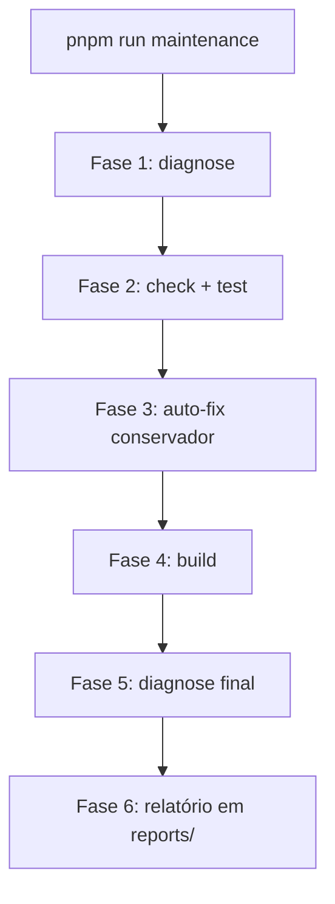

# Manutenção semanal — Task Manager Pro

Este guia descreve a rotina de inspeção, correções conservadoras e revisão manual que você pode executar **uma vez por semana** para manter a ferramenta saudável.

## Comando rápido

```bash
# Local (recomendado toda semana)
pnpm run maintenance

# Local + produção (GCP Cloud Run + Cloud SQL)
pnpm run maintenance -- --prod
```

> **Nota:** use `pnpm run doctor` (não `pnpm doctor`) — o pnpm reserva o comando `doctor` para diagnóstico do próprio gerenciador de pacotes.

## O que a rotina faz



### Fase 1 — Inspeção (read-only)

Executa `pnpm run doctor` com checks de:

- Node 20+ e pnpm
- Variáveis de ambiente (`DATABASE_URL`, `JWT_SECRET`, OAuth em prod)
- Conexão MySQL, versão e migrations pendentes
- Integridade: tasks órfãs, members sem user, invites expirados, ficheiros de attachment em falta
- `/health` local (se o servidor estiver a correr)
- Tamanho de `uploads/`, `node_modules/`
- `pnpm audit` e `pnpm outdated` (alertas apenas)

Com `--prod`, adiciona:

- `GET /health` na URL de produção (Cloud Run ou `CUSTOM_DOMAIN`)
- SELECT read-only na base de produção via Cloud SQL Auth Proxy

### Fase 2 — Qualidade

- `pnpm check` (TypeScript)
- `pnpm test` (Vitest)

### Fase 3 — Auto-fix conservador

| Ação | Comando | Quando |
|------|---------|--------|
| Formatação | `pnpm format` | Sempre |
| Lockfile | `pnpm install --frozen-lockfile` | Sempre |
| Migrations | `pnpm db:migrate` | Só se houver pendentes **e** `DATABASE_URL` apontar para localhost |

**Não faz automaticamente:** correção de órfãos, `db:generate`, `pnpm update`.

### Fase 4 — Build

`pnpm build` com variáveis mínimas para validar que o bundle compila.

### Fase 5 e 6 — Diagnóstico final + relatório

Gera `reports/maintenance-YYYY-MM-DD.md` com status, auto-fixes aplicados, JSON do doctor e checklist manual.

## Scripts individuais

| Comando | Descrição |
|---------|-----------|
| `pnpm run diagnose` | Alias para o doctor (mesmo que `pnpm run doctor`) |
| `pnpm run doctor` | Diagnóstico completo |
| `pnpm run doctor -- --prod` | Local + produção |
| `pnpm run doctor -- --smoke` | Smoke test mínimo (usado no CI) |
| `pnpm run doctor -- --json` | Saída machine-readable |
| `pnpm db:generate` | Gerar migration a partir do schema (só em dev) |
| `pnpm db:migrate` | Aplicar migrations versionadas (deploy e manutenção) |
| `pnpm db:push` | `generate` + `migrate` — atalho para dev local |

### Migrations: dev vs deploy

| Ambiente | Comando | Motivo |
|----------|---------|--------|
| Dev local (schema mudou) | `pnpm db:push` ou `db:generate` + `db:migrate` | Pode criar novos ficheiros SQL |
| Deploy GCP | `./scripts/deploy-gcp.sh migrate` → `pnpm db:migrate` | Nunca gera SQL em produção |
| Manutenção semanal | `pnpm db:migrate` (se pendente, só localhost) | Aplica SQL já versionado |

## Health check

```
GET /health
```

Respostas:

```json
{ "ok": true, "db": "connected", "timestamp": "..." }
```

```json
{ "ok": false, "db": "unavailable", "timestamp": "..." }
```

HTTP **503** quando a app está de pé mas o MySQL não responde.

## Calendário sugerido

| Frequência | Ação |
|------------|------|
| **Semanal** | `pnpm run maintenance -- --prod` |
| **Quinzenal** | Rever relatórios em `reports/` |
| **Mensal** | Verificar backup Cloud SQL no GCP Console; `pnpm update --interactive` (manual) |
| **Por release** | `./scripts/deploy-gcp.sh migrate && ./scripts/deploy-gcp.sh deploy` |

## Checklist manual (após cada rotina)

- [ ] Algum WARN/FAIL em produção? → logs no Cloud Run
- [ ] `pnpm outdated` mostra major versions? → planear upgrade separado
- [ ] Integridade mostrou órfãos? → decidir limpeza manual
- [ ] Backup Cloud SQL verificado este mês?
- [ ] Atualizar `docs/TODO.md` se algo foi concluído

## Troubleshooting

### `pnpm doctor` não funciona

Use `pnpm run doctor`. O comando sem `run` invoca o doctor interno do pnpm.

### Doctor falha em `db.local.ping`

MySQL não está a correr. Inicie com Docker:

```bash
docker compose up -d mysql
# ou
pnpm dev:up
```

### `--prod` falha no proxy

1. Confirme `scripts/deploy.env` preenchido
2. `gcloud auth login` activo
3. Execute `./scripts/deploy-gcp.sh migrate` uma vez para baixar o proxy em `.cache/`

### Migrations pendentes em produção

Não use `pnpm db:push`. Execute:

```bash
./scripts/deploy-gcp.sh migrate
```

### Relatórios não aparecem no git

`reports/*.md` está no `.gitignore` — são artefactos locais. Só `reports/.gitkeep` é versionado.

## Próximos upgrades seguros (backlog)

Consulte `docs/TODO.md` para o backlog de produto. Prioridades técnicas:

1. Smoke test de integração no CI (implementado)
2. Log de falhas de email (assignments)
3. Script de limpeza de órfãos com `--fix` e confirmação
4. Decidir destino de `drizzle/schema.crm.ts`
