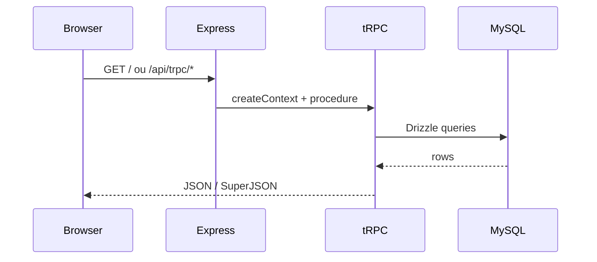

---
tags:
  - task-manager
  - arquitetura
aliases:
  - Stack
  - Architecture
created: 2026-06-23
---

# Arquitetura

Monolith full-stack: React + Express/tRPC + MySQL (Drizzle ORM).

## Stack

| Camada | Tecnologias |
|--------|-------------|
| Frontend | React 19, Vite 7, Tailwind 4, shadcn/ui, wouter, TanStack Query |
| Backend | Express 4, tRPC 11, Zod, SuperJSON |
| Base de dados | MySQL 8, Drizzle ORM, drizzle-kit |
| Auth | Google / Microsoft OAuth, JWT cookies, dev login |
| Email | Resend ou SMTP |
| Storage | Filesystem local ou Forge/S3 |
| Deploy | Docker, GCP Cloud Run + Cloud SQL |

## Estrutura de pastas

```
task-manager/
├── client/           # React SPA
├── server/           # Express + tRPC
│   └── _core/        # bootstrap, OAuth, Vite
├── shared/           # tipos e lógica partilhada
├── drizzle/          # schema + migrations SQL
├── scripts/          # dev-up, deploy-gcp, doctor, maintenance
├── docs/             # documentação (deploy, manutenção, backlog, design, cofre Obsidian)
│   ├── Task-Manager/ # cofre Obsidian (notas interligadas)
│   └── design/       # tokens e IA de navegação
└── reports/          # relatórios de manutenção (gitignored)
```

## Fluxo de request



## Entry point

`server/_core/index.ts`:
- `GET /health` — liveness + DB ping
- `/uploads` — ficheiros estáticos
- `/api/trpc` — API tRPC
- OAuth em `/api/auth/*`
- Vite (dev) ou static (prod)

## Base de dados

- Schema: `drizzle/schema.ts`
- Migrations: `drizzle/0000_*.sql` … `0003_*.sql`
- Acesso: `server/db.ts` — singleton lazy via `getDb()`
- CRM adiado: `drizzle/schema.crm.ts` (não migrado)

## Auth e autorização

- Contexto: `server/_core/context.ts`
- Roles por projeto: owner / admin / member (`server/authz.ts`)
- Owner global: `OWNER_OPEN_ID` em env

## Health check

`GET /health`:

| HTTP | Body | Significado |
|------|------|-------------|
| 200 | `ok: true, db: "connected"` | App + MySQL OK |
| 503 | `ok: false, db: "unavailable"` | App OK, MySQL down |

Usado por Docker healthcheck, Cloud Run e [[Doctor - Diagnóstico]].

## CI (GitHub Actions)

`.github/workflows/ci.yml`:

1. `pnpm install --frozen-lockfile`
2. Espera MySQL (service container)
3. `pnpm db:migrate`
4. `pnpm run doctor --smoke`
5. `pnpm check`
6. `pnpm test`
7. `pnpm build`

## Código não ligado (candidatos a remoção)

Módulos em `server/_core/` sem uso na app:
- `llm.ts`, `imageGeneration.ts`, `dataApi.ts`, `map.ts`, `voiceTranscription.ts`

Página `ComponentShowcase.tsx` — não routada.
