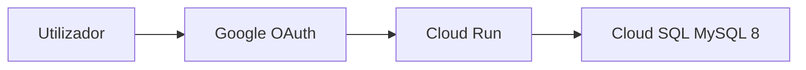

---
tags:
  - task-manager
  - deploy
  - gcp
aliases:
  - Cloud Run
  - Produção
created: 2026-06-23
---

# Deploy GCP

Produção: **Cloud Run** (app) + **Cloud SQL** (MySQL 8) + **Google OAuth**.

Documentação técnica completa: `docs/DEPLOY.md` (no repo).

## Arquitectura



## Configuração

1. Copiar `scripts/deploy.env.example` → `scripts/deploy.env`
2. Preencher: `PROJECT_ID`, `REGION`, passwords, OAuth, etc.
3. **Nunca commitar** `deploy.env` (está no `.gitignore`)

## Comandos principais

```bash
./scripts/deploy-gcp.sh all        # primeira vez: provision + migrate + deploy
./scripts/deploy-gcp.sh provision  # infra + secrets
./scripts/deploy-gcp.sh migrate    # migrations (só db:migrate)
./scripts/deploy-gcp.sh deploy     # build + Cloud Run
./scripts/deploy-gcp.sh whoami     # listar users (OWNER_OPEN_ID)
./scripts/deploy-gcp.sh url        # URL do serviço
```

## Migrate

> [!important] Produção usa `db:migrate`, nunca `db:push`
> `db:push` faz `generate + migrate` — pode criar SQL acidental em produção.

O script `migrate`:
1. Inicia Cloud SQL Auth Proxy na porta 3307
2. Executa `pnpm db:migrate`
3. Encerra proxy

## Pós-deploy

1. Definir redirect URI no Google Console: `{URL}/api/auth/callback`
2. `whoami` → copiar `openId` para `OWNER_OPEN_ID`
3. `deploy` novamente
4. Verificar: `curl {URL}/health`

Resposta esperada:

```json
{ "ok": true, "db": "connected", "timestamp": "..." }
```

## Domínio custom

Definir `CUSTOM_DOMAIN` em `deploy.env` (ex. `https://tasks.seudominio.com`).

Usado para `OAUTH_REDIRECT_BASE_URL` e checks `--prod` do [[Doctor - Diagnóstico]].

## Manutenção em produção

- Semanal: [[Manutenção semanal]] com `--prod`
- Por release: `migrate` → `deploy`
- Mensal: verificar backup Cloud SQL no GCP Console

## Troubleshooting deploy

Ver [[Troubleshooting#Deploy e produção]].
