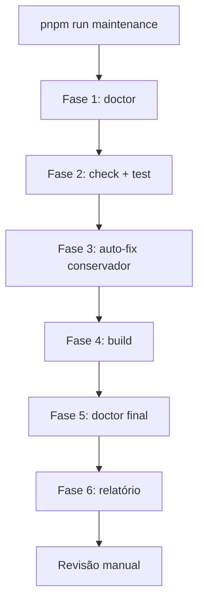

---
tags:
  - task-manager
  - manutencao
  - operacoes
aliases:
  - Maintenance
  - Rotina semanal
created: 2026-06-23
---

# Manutenção semanal

Rotina de inspeção e correções **conservadoras** para manter o Task Manager saudável. Executar **uma vez por semana** (segunda ou sexta).

Relacionado: [[Doctor - Diagnóstico]] · [[Comandos rápidos]] · [[Troubleshooting]]

## Comando único

```bash
# Local
pnpm run maintenance

# Local + produção (GCP)
pnpm run maintenance -- --prod
```

> [!warning] `pnpm doctor` vs `pnpm run doctor`
> Sem `run`, o pnpm executa o *doctor* interno do gerenciador de pacotes. Use sempre `pnpm run doctor`.

## Fluxo das 6 fases



Script: `scripts/weekly-maintenance.sh`

### Fase 1 — Inspeção (read-only)

Executa [[Doctor - Diagnóstico]]:

- Node 20+, pnpm
- Variáveis de ambiente
- MySQL: ping, versão, migrations
- Integridade: órfãos, invites expirados, attachments em falta
- `/health` local (se servidor a correr)
- Tamanho de `uploads/`, `node_modules/`
- `pnpm audit` e `pnpm outdated` (só alerta)

Com `--prod`: health na URL de produção + SELECT read-only via Cloud SQL proxy.

### Fase 2 — Qualidade

- `pnpm check` (TypeScript)
- `pnpm test` (Vitest, 19 testes)

### Fase 3 — Auto-fix conservador

| Ação | Comando | Quando |
|------|---------|--------|
| Formatação | `pnpm format` | Sempre |
| Lockfile | `pnpm install --frozen-lockfile` | Sempre |
| Migrations | `pnpm db:migrate` | Pendentes **e** `DATABASE_URL` = localhost |

> [!caution] O que NÃO é auto-fix
> - Correção de órfãos no DB
> - `db:generate` (criar SQL novo)
> - `pnpm update`

### Fase 4 — Build

`pnpm build` — valida que client + server compilam.

### Fases 5 e 6 — Diagnóstico final + relatório

Gera `reports/maintenance-YYYY-MM-DD.md` com:

- branch e commit git
- status OK / WARN / FAIL por check
- auto-fixes aplicados
- JSON do doctor
- checklist manual

> [!note] Relatórios locais
> `reports/*.md` está no `.gitignore`. Só `reports/.gitkeep` é versionado.

## Checklist manual (após cada rotina)

- [ ] WARN/FAIL em produção? → logs Cloud Run
- [ ] `pnpm outdated` com major versions? → planear upgrade separado
- [ ] Integridade com órfãos? → limpeza manual (futuro `--fix`)
- [ ] Backup Cloud SQL verificado este mês?
- [ ] Atualizar [[Roadmap e backlog]] / `docs/TODO.md` se algo foi concluído

## Calendário

| Frequência | Ação |
|------------|------|
| **Semanal** | `pnpm run maintenance -- --prod` |
| **Quinzenal** | Rever pasta `reports/` |
| **Mensal** | Backup Cloud SQL (GCP Console); `pnpm update --interactive` |
| **Por release** | [[Deploy GCP#Migrate]] + deploy |

## Flags do script

```bash
./scripts/weekly-maintenance.sh --prod       # inclui checks GCP
./scripts/weekly-maintenance.sh --skip-fix   # sem auto-fix
./scripts/weekly-maintenance.sh --skip-build # sem build
```

## Exit codes

| Código | Significado |
|--------|-------------|
| `0` | Tudo OK |
| `2` | Concluído com WARN — rever relatório |
| `1` | FAIL — ação necessária |
