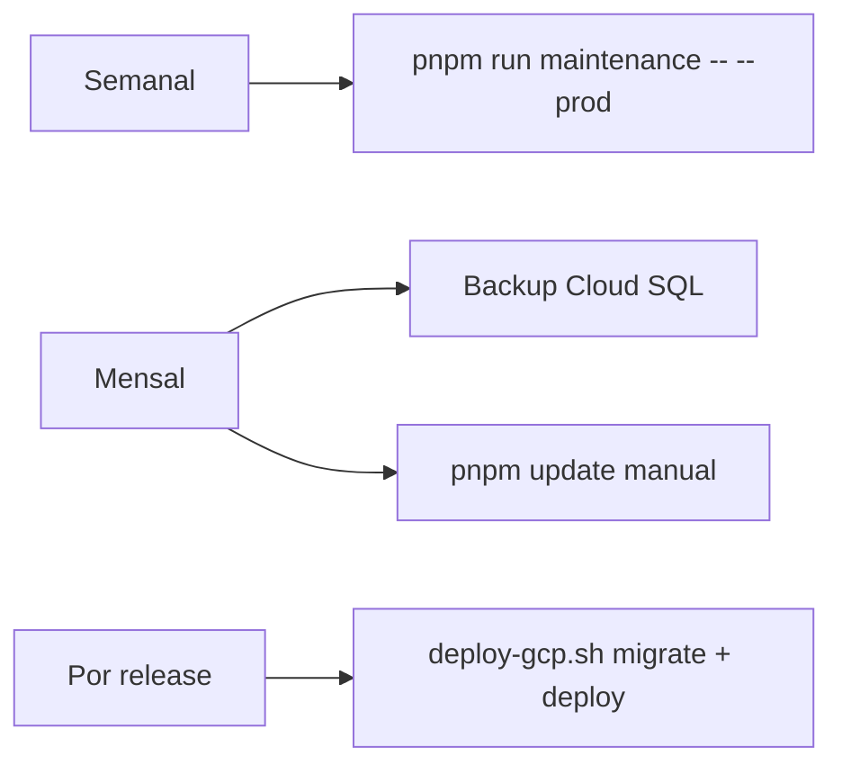

---
tags:
  - task-manager
  - index
aliases:
  - Home
  - Índice
created: 2026-06-23
---

# Task Manager Pro

Hub de documentação do projeto **Task Manager Pro** — gestão de projetos com Kanban, equipa e KPIs financeiros.

> [!info] Repositório
> Código em `task-manager/` (monolith React + Express/tRPC + MySQL).

## Mapa do cofre

| Nota | Conteúdo |
|------|----------|
| [[Manutenção semanal]] | Rotina semanal, auto-fixes, relatórios |
| [[Doctor - Diagnóstico]] | Script `doctor.ts`, checks e flags |
| [[Desenvolvimento local]] | Setup, `.env`, Docker, `dev:up` |
| [[Deploy GCP]] | Cloud Run + Cloud SQL, `deploy-gcp.sh` |
| [[Arquitetura]] | Stack, pastas, fluxos |
| [[Comandos rápidos]] | Cheat sheet de `pnpm` e scripts |
| [[Roadmap e backlog]] | Features feitas e pendentes |
| [[UI e UX - Hub]] | Planeamento UI/UX (cursor-designer + ui-ux-pro-max) |
| [[Troubleshooting]] | Problemas comuns e soluções |

## Rotina recomendada

## Links externos no repo

- `README.md` — quick start
- `docs/DEPLOY.md` — deploy detalhado (inglês)
- `docs/MAINTENANCE.md` — cópia técnica da rotina de manutenção

## Status atual (v1)

- [x] Kanban, equipa, KPIs, OAuth, email, attachments, comments
- [x] Rotina de manutenção (`doctor` + `maintenance`)
- [x] `/health` com verificação de MySQL
- [ ] Gantt / timeline
- [ ] Export Excel (CSV já existe)
- [ ] Board mobile dedicado

Ver detalhes em [[Roadmap e backlog]].
