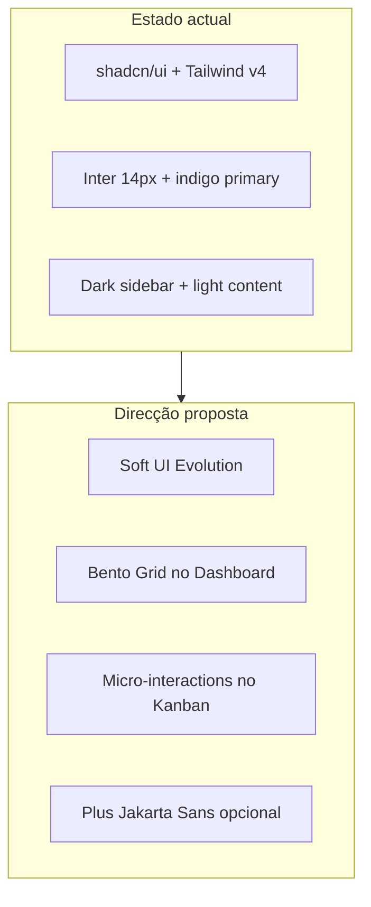

---
tags:
  - task-manager
  - ui
  - ux
  - design
aliases:
  - UI Hub
  - Design
created: 2026-06-23
---

# UI e UX — Hub de planeamento

Base de conhecimento para melhorar a interface do **Task Manager Pro**, sintetizada a partir de:

| Fonte | Repositório | Papel |
|-------|-------------|-------|
| **Cursor Designer** | [spencergoldade/cursor-designer](https://github.com/spencergoldade/cursor-designer) | Princípios UX/UI/IA/a11y, tokens, IA de navegação, guardrails para Cursor |
| **UI UX Pro Max** | [nextlevelbuilder/ui-ux-pro-max-skill](https://github.com/nextlevelbuilder/ui-ux-pro-max-skill) | Design system generator, 67 estilos, 99 guidelines UX, stack React/shadcn |
| **OK Skills** | [mxyhi/ok-skills](https://github.com/mxyhi/ok-skills) | 30 skills: planning, QA browser, protótipos, ícones, refactor, docs |

## Mapa de notas

| Nota | Conteúdo |
|------|----------|
| [[UI/Audit - Estado atual]] | Inventário da UI existente, gaps e pontos fortes |
| [[UI/Design System - Recomendacao]] | Direção visual proposta (tokens, tipografia, estilos por ecrã) |
| [[UI/Princípios UX - Cursor Designer]] | Regras always-on e checklist de qualidade |
| [[UI/Plano de melhorias UI]] | Backlog priorizado com fases e critérios de aceitação |
| [[UI/OK Skills - Catalogo e uso]] | Skills ok-skills aplicáveis (planning, QA, protótipos, refactor) |

## Direção recomendada (resumo)

**Manter:** stack React + shadcn/ui, paleta indigo, Lucide icons, dark mode.  
**Evoluir:** hierarquia visual, dashboard modular, mobile Kanban, a11y (skip link, reduced motion), consistência de formulários.

## Stack UI actual

| Camada        | Tecnologia                                    |
| ------------- | --------------------------------------------- |
| Framework     | React 19 + Vite                               |
| Routing       | wouter                                        |
| Componentes   | shadcn/ui (Radix)                             |
| Estilo        | Tailwind CSS v4 + CSS variables (`index.css`) |
| Ícones        | Lucide React                                  |
| Drag-and-drop | @dnd-kit                                      |
| Charts        | Recharts (Finance)                            |
| Toasts        | Sonner                                        |

## Ecrãs principais

| Rota | Página | Prioridade UX |
|------|--------|---------------|
| `/` | Dashboard | Alta — primeiro impacto |
| `/projects` | Projects | Média |
| `/projects/:id/board/:id` | BoardView (Kanban) | **Crítica** — core product |
| `/team` | Team | Média |
| `/finance` | Finance KPI | Média — data-dense |
| `/settings` | Settings | Baixa |
| Login | DashboardLayout | Média |

## Como usar este cofre

1. Ler [[UI/Audit - Estado atual]] para baseline.
2. Validar [[UI/Design System - Recomendacao]] com stakeholders (cores, fonte).
3. Implementar por fases em [[UI/Plano de melhorias UI]].
4. Opcional — instalar tooling:
   - Cursor Designer → `.cursor/rules/` (lean profile)
   - UI UX Pro Max → `npx uipro-cli init --ai cursor`
   - OK Skills → `git clone` em `~/.agents/skills/ok-skills` (ver [[UI/OK Skills - Catalogo e uso]])

## Ligações

- [[Task Manager Pro]] — índice geral
- [[Roadmap e backlog]] — features de produto (Gantt, mobile, Excel)
- `client/src/index.css` — tokens CSS actuais
- `client/src/components/DashboardLayout.tsx` — shell da app
