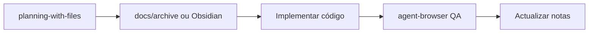
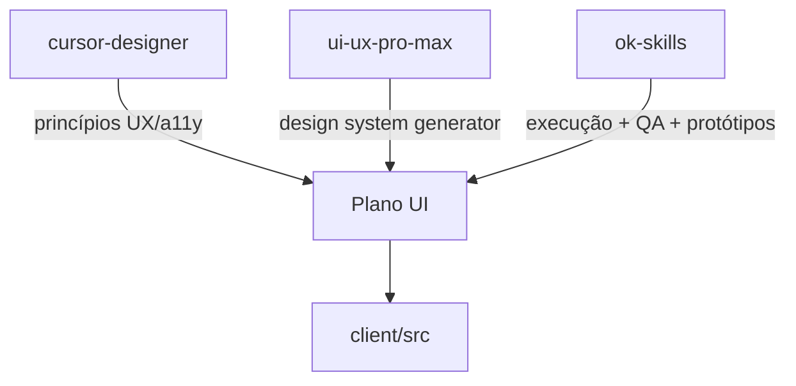

---
tags:
  - task-manager
  - ui
  - skills
  - ok-skills
created: 2026-06-23
---

# OK Skills — Catálogo e uso

Integração do [ok-skills](https://github.com/mxyhi/ok-skills) no planeamento UI do Task Manager Pro. Repositório com **30 skills** reutilizáveis para Cursor, Claude Code, Codex e outras ferramentas compatíveis com `SKILL.md`.

## Instalação

```bash
mkdir -p ~/.agents/skills
cd ~/.agents/skills
git clone https://github.com/mxyhi/ok-skills.git ok-skills
```

Para Cursor, as skills ficam disponíveis em `~/.agents/skills/ok-skills/<skill-name>/SKILL.md`. Podes também copiar skills individuais para `~/.cursor/skills/` ou referenciar no `AGENTS.md` do projecto.

### Skills prioritárias para este projecto

Adicionar ao `AGENTS.md` ou pedir explicitamente no chat:

```md
## Skills (Task Manager Pro)

- planning-with-files: UI phases com 5+ passos (Fase 1–4 do plano UI).
- agent-browser: QA visual, regressões, dogfooding após mudanças UI.
- better-icons: pesquisar ícones Iconify além do Lucide actual.
- find-docs: docs actuais shadcn/ui, dnd-kit, Recharts, Tailwind v4.
- grill-me: stress-test do plano UI antes de implementar fases grandes.
- huashu-design: protótipos HTML hi-fi e crítica de design (não produção).
- codebase-design: refactor profundo de BoardView e módulos UI.
```

## Mapa por categoria

### Frontend & Design (directamente relevantes)

| Skill | Quando usar no Task Manager Pro | Link |
|-------|----------------------------------|------|
| **huashu-design** | Protótipos HTML do Dashboard Bento, variantes visuais, crítica 5D antes de codar | `huashu-design/SKILL.md` |
| **better-icons** | Auditar ícones Lucide; explorar Tabler/Heroicons para Finance/Kanban | `better-icons/SKILL.md` |
| **ai-elements** | Se evoluir `AIChatBox` para UI de chat AI-native (shadcn + AI SDK) | `ai-elements/SKILL.md` |

### Planning & Qualidade de plano

| Skill | Quando usar | Link |
|-------|-------------|------|
| **planning-with-files** | Cada fase UI → `docs/archive/ui-upgrade/` (histórico) ou notas Obsidian | `planning-with-files/SKILL.md` |
| **grill-me** | Entrevista 1-pergunta-de-cada-vez sobre decisões (mobile Kanban A vs B) | `grill-me/SKILL.md` |
| **grill-with-docs** | Validar plano contra `design/` e notas Obsidian | `grill-with-docs/SKILL.md` |
| **karpathy-guidelines** | Evitar over-engineering em refactors UI | `karpathy-guidelines/SKILL.md` |

### Automation & QA

| Skill | Quando usar | Link |
|-------|-------------|------|
| **agent-browser** | Screenshots 375/768/1024px, testar login, drag Kanban, dark mode | `agent-browser/SKILL.md` |
| **browser-trace** | Debug falhas de automação com traces CDP | `browser-trace/SKILL.md` |

### Research & Docs

| Skill | Quando usar | Link |
|-------|-------------|------|
| **find-docs** | API dnd-kit KeyboardSensor, shadcn Breadcrumb, Tailwind v4 @theme | `find-docs/SKILL.md` |
| **get-api-docs** | Docs de SDKs terceiros antes de integrar | `get-api-docs/SKILL.md` |
| **find-skills** | Descobrir skills adicionais (ex.: ui-ux-pro-max, cursor-designer) | `find-skills/SKILL.md` |

### Arquitectura de código UI

| Skill | Quando usar | Link |
|-------|-------------|------|
| **codebase-design** | Deep modules: extrair `TaskCard`, `Column`, hooks Kanban de `BoardView.tsx` | `codebase-design/SKILL.md` |
| **improve-codebase-architecture** | Oportunidades de locality/leverage no client | `improve-codebase-architecture/SKILL.md` |
| **tdd** | Testes de comportamento antes de refactor UI crítico | `tdd/SKILL.md` |
| **systematic-debugging** | Bugs visuais ou DnD antes de propor fix | `systematic-debugging/SKILL.md` |

### Authoring (secundário)

| Skill | Uso potencial |
|-------|---------------|
| minimax-xlsx | Export Excel (alinha com [[Roadmap e backlog]]) |
| minimax-pdf | Relatórios Finance KPI em PDF |
| pptx-generator | Apresentações para stakeholders |

---

## Workflows recomendados

### Workflow A — Implementar fase UI com planning



1. `Use planning-with-files` — planear fase escolhida de [[UI/Plano de melhorias UI]]
2. Implementar alterações em `client/src/`
3. `Use agent-browser` — screenshots nos breakpoints do checklist uupm
4. Actualizar notas Obsidian ou `docs/archive/ui-upgrade/`

### Workflow B — Explorar direcção visual (antes de codar)

1. `Use huashu-design` — 3 variantes HTML do Dashboard Bento (não React)
2. Critique 5 dimensões (huashu `critique-guide`): filosofia, hierarquia, craft, funcionalidade, originalidade
3. `Use grill-me` — validar escolha com uma pergunta de cada vez
4. Documentar decisão em [[UI/Design System - Recomendacao]]
5. Implementar em React/shadcn

### Workflow C — Refactor BoardView

`BoardView.tsx` tem ~980 linhas — candidato a **codebase-design**:

| Módulo proposto | Interface pequena | Implementation profunda |
|-----------------|-------------------|-------------------------|
| `useKanbanBoard` | `{ columns, moveTask, ... }` | tRPC + optimistic updates |
| `TaskCard` | props task + callbacks | dnd-kit sortable |
| `ColumnHeader` | name, count, actions | — |
| `TaskDetailDialog` | open, taskId | comments, attachments |

Pedir: *"Use codebase-design to propose seams for BoardView.tsx"*

### Workflow D — QA pré-release UI

Combinar **agent-browser** + checklist [[UI/Plano de melhorias UI#Checklist pre-release UI]]:

```text
Use agent-browser to:
1. Login (Google dev or mock)
2. Screenshot Dashboard at 375px and 1440px
3. Open a board, drag a task between columns
4. Toggle dark mode, re-screenshot
5. Tab through sidebar — verify focus visible
```

Skill especializada: `agent-browser skills get dogfood`

---

## huashu-design — aplicável vs não aplicável

| Cenário | huashu-design | Produção React |
|---------|---------------|----------------|
| Explorar 3 layouts Dashboard Bento | ✓ HTML prototype | Depois migrar |
| Kanban mobile swipe mockup | ✓ interactive demo | Implementar em BoardView |
| Melhorar app em produção | ✗ não é para web app SEO/backend | shadcn + [[UI/Design System - Recomendacao]] |
| Anti-AI-slop review | ✓ critique 5D | Evitar gradient slop, icon slop |

**Princípios huashu úteis mesmo em produção:**
- Junior designer: mostrar assumptions antes de implementar
- 3 variações, não uma "resposta final"
- Placeholder honesto > implementação fraca
- Sem filler content (stats decorativos no Dashboard)

---

## better-icons + Task Manager Pro

Stack actual: **Lucide** (`lucide-react`). Skill permite explorar 200+ bibliotecas Iconify.

```bash
npm install -g better-icons
better-icons search kanban --prefix lucide --limit 10
better-icons search chart --prefix tabler --limit 10
better-icons get lucide:grip-vertical > icon.svg
```

**Quando considerar mudança:** apenas se Lucide não tiver ícone semântico; manter consistência de stroke width.

---

## ai-elements — AIChatBox futuro

O projecto já tem `client/src/components/AIChatBox.tsx`. Skill **ai-elements** (Vercel) adiciona:
- Conversation, Message, PromptInput
- Tool displays, streaming
- Base shadcn/ui (compatível com stack actual)

**Pré-requisitos ai-elements:** Next.js + AI SDK — este projecto usa Vite/wouter. Usar skill para **padrões composáveis**, adaptando manualmente para Vite, ou avaliar se feature AI fica fora de scope v1.

---

## Combinação das 3 fontes de design



| Momento | Ferramenta |
|---------|------------|
| Definir regras | cursor-designer `.mdc` |
| Gerar paleta/estilo | uupm `search.py --design-system` |
| Planear fase | ok-skills `planning-with-files` |
| Prototipar | ok-skills `huashu-design` |
| Implementar | Cursor + karpathy-guidelines |
| Testar | ok-skills `agent-browser` |
| Refactor | ok-skills `codebase-design` |

---

## Referências

- Repo: https://github.com/mxyhi/ok-skills
- Playbook: `CLAUDE_AGENTS.md` no repo
- Índice completo: 30 skills em `README.md`

## Ligações

- [[UI e UX - Hub]]
- [[UI/Plano de melhorias UI]]
- [[UI/Princípios UX - Cursor Designer]]
- [[UI/Design System - Recomendacao]]
