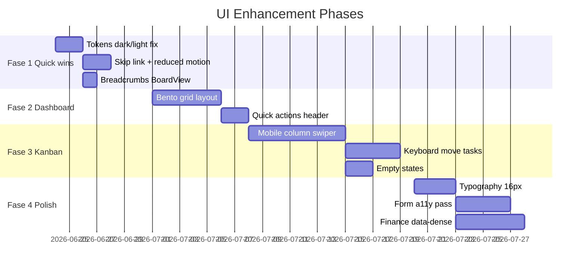

---
tags:
  - task-manager
  - ui
  - backlog
  - roadmap
created: 2026-06-23
---

# Plano de melhorias UI

Backlog priorizado derivado de [[UI/Audit - Estado atual]], [[UI/Design System - Recomendacao]] e [[UI/Princípios UX - Cursor Designer]].

> [!tip] Relação com produto
> Features em [[Roadmap e backlog]] (Gantt, Excel export) são **produto**; este plano foca **experiência visual e interacção** sem alterar scope funcional.

## Visão por fases

---

## Fase 1 — Quick wins (1 semana)

### 1.1 Unificar tokens dark/light primary
**Problema:** Light usa indigo oklch; dark usa `blue-700` Tailwind.  
**Fix:** `client/src/index.css` — dark `--primary` = oklch indigo harmonizado.  
**Critério:** Mesma identidade visual em ambos os modos; contraste AA no botão primary.  
**Estado:** ✅ Concluído (2026-06-23)

### 1.2 Skip link + landmarks
**Guideline:** uupm UX — skip links (severidade média).  
**Fix:** Link "Skip to main content" em `DashboardLayout`; `<main id="main-content">` no `SidebarInset`.  
**Critério:** Tab desde load → skip link → main em ≤2 tabs.  
**Estado:** ✅ Concluído (2026-06-23)

### 1.3 prefers-reduced-motion
**Fix:** `@media (prefers-reduced-motion: reduce)` em `index.css` — desactivar `card-hover` translate, drag overlay rotate, `animate-pulse` skeletons → static.  
**Critério:** Respeita OS setting.  
**Estado:** ✅ Concluído (2026-06-23)

### 1.4 Breadcrumbs no BoardView
**Guideline:** cursor-designer IA — `Projects / {project} / {board}`.  
**Fix:** Componente Breadcrumb shadcn no topo de `BoardView.tsx`.  
**Critério:** Cada segmento clickable excepto o actual.  
**Estado:** ✅ Concluído (2026-06-23)

---

## Fase 2 — Dashboard Bento (1–2 semanas)

### 2.1 Layout Bento Grid
**Estado:** ✅ Concluído (2026-06-23)

### 2.2 Quick actions above fold
**Estado:** ✅ Concluído (2026-06-23)

---

## Fase 3 — Kanban mobile & a11y (2 semanas)

### 3.1 Vista mobile dedicada
**Estado:** ✅ Concluído (2026-06-23)

### 3.2 Keyboard task movement
**Estado:** ✅ Concluído (2026-06-23) — menu "Move to column…"

### 3.3 Empty states
**Estado:** ✅ Concluído (2026-06-23)

### 3.4 Drag affordance
**Estado:** ✅ Concluído (cursor-grab já presente)

---

## Fase 4 — Polish & Finance (1–2 semanas)

### 4.1 Tipografia 16px + Plus Jakarta Sans
**Estado:** ✅ Concluído (2026-06-23)

### 4.2 Form accessibility pass
**Estado:** ✅ Concluído (2026-06-23)

### 4.3 Finance data-dense layout
**Estado:** ✅ Concluído (2026-06-23)

### 4.4 Design docs no repo
**Estado:** ✅ Concluído — `docs/design/tokens/*`, `docs/design/ia/navigation.md`

---

## Detalhe original (referência)

### 2.1 Layout Bento Grid
**Estilo:** uupm Bento Box Grid.  
**Alterações em `Dashboard.tsx`:**
- CSS Grid 4 colunas desktop
- Stat cards com `col-span-1|2` variado
- Fundo página: `bg-muted/30` ou `#F5F5F7` light

| Widget | Span | Conteúdo |
|--------|------|----------|
| Hero greeting + CTAs | 4×1 | "Good morning" + New Project + View Boards |
| Active / Overdue / Due today | 1×1 each | KPIs existentes |
| Recent projects | 2×2 | Lista actual |
| Team workload | 2×1 | Link → /team |
| Finance snapshot | 2×1 | Mini chart ou link → /finance |
| Activity | 2×1 | Feed recente |

**Critério:** Responsive 4→2→1; hover scale 1.02 em cards clickable.

### 2.2 Quick actions above fold
**Guideline:** cursor-designer — primary action visually distinct.  
**CTAs:** "+ New Project" (primary), "Open last board" (secondary).

---

## Fase 3 — Kanban mobile & a11y (2 semanas)

### 3.1 Vista mobile dedicada
**Problema:** [[Roadmap e backlog]] — board mobile parcial.  
**Opção recomendada:** Horizontal snap scroll — 1 coluna full-width por viewport; dots/tabs indicador.  
**Alternativa:** Bottom tab bar com nome da coluna.

**Ficheiro:** `BoardView.tsx` + possível `useIsMobile()` hook (já existe).  
**Critério:** 375px — zero scroll vertical infinito entre colunas; swipe natural.

### 3.2 Keyboard task movement
**Guideline:** uupm + cursor-designer a11y — keyboard navigation alta severidade.  
**Fix:** Adicionar `KeyboardSensor` ao dnd-kit OU dropdown "Move to column" no task menu.  
**Critério:** Mover task Todo → Done só com teclado.

### 3.3 Empty states
**Componente:** shadcn `Empty` em colunas sem tasks e projects list vazia.  
**Copy:** Action-based — "Add your first task" com botão.

### 3.4 Drag affordance
- `cursor-grab` / `cursor-grabbing` no handle
- Tooltip first-use opcional (progressive disclosure)

---

## Fase 4 — Polish & Finance (1–2 semanas)

### 4.1 Tipografia 16px base
**Decisão:** body 14px → 16px; rever densidade Kanban cards.  
**Opcional:** Plus Jakarta Sans (test A/B visual).  
**Critério:** Legibilidade em Finance tables sem overflow.

### 4.2 Form accessibility pass
**Modais:** Create Project, Create Task, Invite, Settings.  
**Checklist cursor-designer:**
- [ ] `htmlFor` + `id` em todos labels
- [ ] `aria-invalid` + `role="alert"` em erros
- [ ] `aria-describedby` para help text
- [ ] Disable submit durante mutation + loading state

### 4.3 Finance data-dense layout
**Estilo:** uupm Data-Dense Dashboard.  
**Alterações em `Finance.tsx`:**
- KPI row compact (padding 12px)
- Tabela font 13–14px, row height 36px
- Sticky header na tabela
- Export CSV button mais visível (secondary → outline com icon)

### 4.4 Design docs no repo
Criar `docs/design/tokens/*.md` e `docs/design/ia/navigation.md` (templates cursor-designer).  
Opcional: `uipro init --ai cursor` para skill local.

---

## Matriz prioridade × esforço

| Item | Impacto | Esforço | Fase |
|------|---------|---------|------|
| Kanban mobile | 🔴 Alto | Alto | 3 |
| Dashboard Bento | 🟠 Médio-alto | Médio | 2 |
| Dark/light tokens | 🟡 Médio | Baixo | 1 |
| Skip link + motion | 🟡 Médio | Baixo | 1 |
| Keyboard kanban | 🟠 Médio | Médio | 3 |
| Form a11y | 🟡 Médio | Médio | 4 |
| Finance dense | 🟡 Médio | Médio | 4 |
| Plus Jakarta Sans | 🟢 Baixo | Baixo | 4 |

---

## Checklist pre-release UI (combinado uupm + cursor-designer)

### Visual
- [ ] Sem valores spacing ad-hoc (só escala tokens)
- [ ] Primary/secondary buttons distinguíveis
- [ ] Dark mode coerente com light
- [ ] Ícones Lucide (sem emoji)

### Interacção
- [ ] Hover 150–300ms
- [ ] Loading states em mutações
- [ ] Toasts para success/error
- [ ] Confirm dialogs em acções destructivas

### A11y
- [ ] Contraste 4.5:1 texto normal
- [ ] Focus visible em custom components
- [ ] Skip link
- [ ] prefers-reduced-motion
- [ ] Heading hierarchy h1→h2 sem saltos

### Responsive
- [ ] 375px — login, dashboard, kanban
- [ ] 768px — sidebar collapse
- [ ] 1024px — board multi-column
- [ ] 1440px — max-width container

---

## Próximo passo sugerido

Todas as fases 1–4 estão concluídas. Validar manualmente em 375/768/1024px e dark mode. Opcional: `agent-browser` dogfood.

### Skills ok-skills por fase

| Fase | Skills recomendadas |
|------|---------------------|
| 1 Quick wins | `planning-with-files`, `find-docs` (shadcn Breadcrumb), `agent-browser` (QA) |
| 2 Dashboard Bento | `huashu-design` (3 variantes HTML), `grill-me` (validar layout), `agent-browser` |
| 3 Kanban mobile | `find-docs` (dnd-kit), `huashu-design` (mockup swipe), `agent-browser` dogfood |
| 4 Polish | `better-icons`, `codebase-design` (split BoardView), `tdd` |

Detalhes em [[UI/OK Skills - Catalogo e uso]].

Para implementar com Cursor AI:
1. Copiar lean profile do cursor-designer para `.cursor/rules/`
2. `git clone https://github.com/mxyhi/ok-skills.git ~/.agents/skills/ok-skills`
3. `npx uipro-cli init --ai cursor` (opcional)
4. Prompt: *"Use planning-with-files. Implement Fase 1 from docs/Task-Manager/UI/Plano de melhorias UI.md"*

---

## Ligações

- [[UI e UX - Hub]]
- [[Roadmap e backlog]]
- [[Task Manager Pro]]
