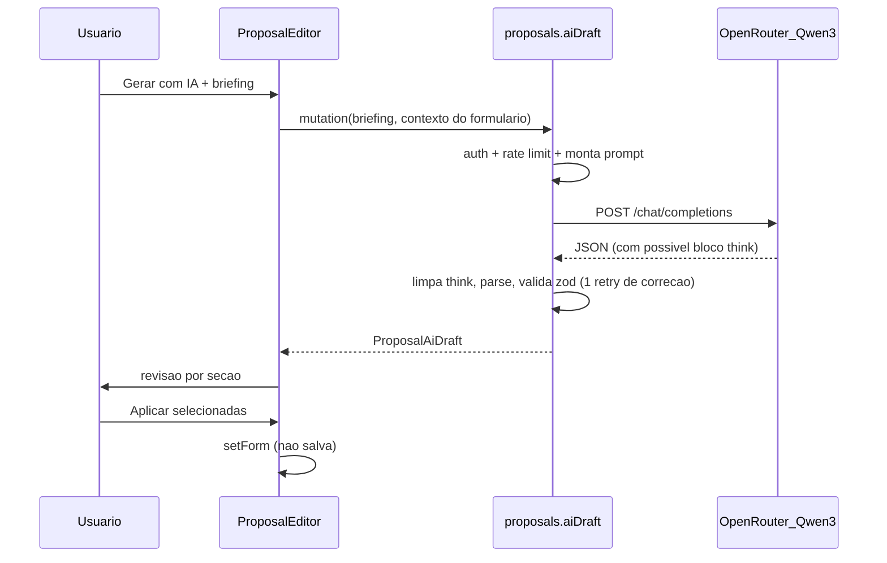

# SPEC-15 — Assistente de IA para propostas comerciais

Status: Proposta (aguardando aprovação)
Depende de: gerador de propostas (`/proposals`, tabela `proposals`)
Modelo: Qwen3 via OpenRouter (`OPENROUTER_MODEL`, padrão `qwen/qwen3-235b-a22b`)

## 1. Objetivo

Reduzir o tempo para montar uma proposta: a partir dos dados do lead e de um briefing curto escrito pelo usuário, a IA gera um rascunho de **apresentação, escopo, itens de investimento, condições de pagamento e prazo**. O usuário revisa e decide o que aplicar no formulário. A IA nunca salva nada sozinha.

## 2. Escopo

Dentro:
- Botão "Gerar com IA" no editor de propostas (`/proposals/new` e `/proposals/:id`).
- Diálogo de briefing, geração, revisão por seção e aplicação no formulário.
- Ação "Melhorar texto" nos campos Apresentação e Escopo (reescrita do texto existente).
- Cliente OpenRouter no servidor, validação da resposta, limite de uso e erros amigáveis.

Fora (futuro):
- Streaming token a token.
- Histórico e auditoria das gerações no banco.
- Uso de propostas anteriores como exemplo (few-shot a partir do histórico).
- Tradução para outros idiomas.

## 3. Requisitos funcionais

| ID | Requisito |
|----|-----------|
| RF-01 | O editor mostra o botão "Gerar com IA" somente quando a IA está configurada (`OPENROUTER_API_KEY` definida e diferente do placeholder). Caso contrário, o botão aparece desabilitado com um tooltip explicando como configurar. |
| RF-02 | O diálogo de briefing contém: descrição do que será entregue (obrigatória, de 20 a 2000 caracteres), orçamento-alvo (pré-preenchido com o `estimatedValue` do lead), tom (formal, consultivo ou direto) e as seções a gerar (checkboxes, todas marcadas por padrão). |
| RF-03 | O contexto enviado à IA inclui: cliente, título, contato, valor estimado do lead e o conteúdo atual do formulário (para a IA complementar, e não contradizer). |
| RF-04 | A resposta é exibida seção por seção, cada uma com o checkbox "Aplicar" (marcado por padrão). Os itens mostram quantidade, valor unitário e total, e o somatório é comparado ao orçamento-alvo. |
| RF-05 | "Aplicar selecionadas" substitui os campos escolhidos no formulário. Os itens gerados substituem a lista atual, a menos que o usuário marque "Adicionar aos itens existentes". |
| RF-06 | Ao aplicar, a proposta fica com "alterações não salvas". A IA não salva nem muda o status da proposta. |
| RF-07 | "Gerar novamente" refaz a geração com o mesmo briefing, e "Voltar" permite editar o briefing. |
| RF-08 | "Melhorar texto" (ícone ao lado dos campos Apresentação e Escopo) reescreve o texto atual no tom escolhido e mostra antes e depois, com "Substituir" e "Descartar". Fica desabilitado se o campo estiver vazio. |
| RF-09 | Os valores sugeridos são sempre números positivos em BRL. Quando há orçamento-alvo, a soma dos itens fica a até 10% dele; se a IA desviar mais que isso, a interface mostra um alerta, sem bloquear. |
| RF-10 | Os textos são gerados em português do Brasil, sem markdown (o PDF não renderiza markdown). Listas usam o formato "1. ", uma por linha. |

## 4. Requisitos não funcionais

| ID | Requisito |
|----|-----------|
| RNF-01 | A chave da API fica só no servidor e nunca é enviada ao cliente nem aparece em logs. |
| RNF-02 | A chamada tem timeout de 60 s. Um erro de rede ou 5xx gera uma nova tentativa automática. |
| RNF-03 | Limite de uso: 10 gerações por usuário a cada 10 minutos (em memória). Acima disso, a API retorna `TOO_MANY_REQUESTS` com a mensagem "Aguarde alguns minutos". |
| RNF-04 | A resposta da IA é validada com zod. Se o JSON for inválido, o servidor pede a correção ao modelo uma única vez e, se falhar de novo, retorna um erro amigável. |
| RNF-05 | O servidor remove blocos `<think>...</think>` (modo de raciocínio do Qwen3) e cercas de código do texto antes de interpretar o JSON. |
| RNF-06 | Custo: `max_tokens` de 2500 por geração e 1200 por "Melhorar texto". O log registra `usage.total_tokens` e a duração, sem o conteúdo. |
| RNF-07 | A autorização é a mesma de `proposals.create`. Com `leadId`, aplica-se a mesma checagem de acesso ao lead (`assertLinkAccess`). |

## 5. Critérios de aceite

- **CA-01:** Dado um lead "Acme Ltda" com valor estimado de R$ 18.500, quando o usuário abre "Gerar com IA" pelo editor, então o orçamento-alvo aparece preenchido com R$ 18.500.
- **CA-02:** Dado um briefing válido, quando o usuário clica em "Gerar", então em até 60 s aparecem as seções com apresentação, escopo (lista numerada), de 2 a 8 itens, condições de pagamento e prazo.
- **CA-03:** Dado um resultado gerado, quando o usuário desmarca "Itens" e clica em "Aplicar selecionadas", então só os textos mudam, os itens atuais continuam iguais e o indicador "Não salvo" aparece.
- **CA-04:** Dado que `OPENROUTER_API_KEY` está vazia ou é o placeholder, quando o usuário abre o editor, então o botão fica desabilitado com um tooltip, e uma chamada direta à API retorna `PRECONDITION_FAILED`.
- **CA-05:** Dado que o modelo devolve texto fora do formato JSON duas vezes, quando o usuário gera, então aparece o toast "A IA não retornou um formato válido. Tente novamente" e o formulário não muda.
- **CA-06:** Dado que o usuário fez 10 gerações em 10 minutos, quando ele tenta a 11ª, então vê a mensagem de limite e nenhuma chamada é feita ao OpenRouter.
- **CA-07:** Dado um texto em Apresentação, quando o usuário clica em "Melhorar texto", então vê o antes e depois, e "Descartar" mantém o texto original.
- **CA-08:** Dado que os itens gerados somam mais de 10% acima do orçamento-alvo, então a revisão mostra o alerta "Total sugerido difere do orçamento-alvo".

## 6. Design técnico

### 6.1 Fluxo



### 6.2 Arquivos

| Arquivo | Mudança |
|---------|---------|
| `server/_core/env.ts` | Já tem `openRouterApiKey`, `openRouterModel` e `openRouterBaseUrl`. Falta adicionar o helper `isOpenRouterConfigured()`, que rejeita valor vazio e `sk-or-v1-your-key-here`. |
| `server/_core/openRouter.ts` (novo) | `chatCompletion({ messages, maxTokens, temperature, signal })`: usa `fetch` com os headers `Authorization`, `HTTP-Referer` (`OAUTH_REDIRECT_BASE_URL`) e `X-Title: Task Manager`, com timeout via `AbortController` e 1 nova tentativa em caso de erro de rede ou 5xx. Retorna `{ content, usage, model }`. |
| `shared/proposalAi.ts` (novo) | Schemas zod `ProposalAiBriefing`, `ProposalAiDraft` e `ProposalAiRewrite`, além de `extractJson(text)` (remove `<think>` e cercas, pega o primeiro objeto JSON) e `budgetDeviation(items, target)`. |
| `shared/proposalAi.test.ts` (novo) | Testes de `extractJson` (com think, com cercas, JSON inválido), dos schemas e do desvio de orçamento. |
| `server/proposalAi.ts` (novo) | `buildDraftMessages(briefing, context)`, `buildRewriteMessages(...)`, `generateDraft()` (chamada, parse, validação e 1 retry de correção) e o rate limiter em memória (`Map<userId, timestamps[]>`). |
| `server/proposalAi.test.ts` (novo) | Testes com `chatCompletion` mockado: caminho feliz, retry de correção, falha dupla, limite de uso e chave ausente. |
| `server/routers.ts` | Em `proposalsRouter`: `aiStatus` (query que retorna `{ enabled, model }`), `aiDraft` (mutation) e `aiRewrite` (mutation). Os erros usam `TRPCError`: `PRECONDITION_FAILED`, `TOO_MANY_REQUESTS`, `BAD_GATEWAY` e `TIMEOUT`. |
| `client/src/components/proposals/AiDraftDialog.tsx` (novo) | Diálogo em dois passos (Briefing e Revisão), com os estados de carregamento, erro e revisão por seção. |
| `client/src/components/proposals/AiRewriteButton.tsx` (novo) | Ícone com popover mostrando o antes e depois. |
| `client/src/pages/ProposalEditor.tsx` | Botão "Gerar com IA" na barra superior, `AiRewriteButton` nos campos Apresentação e Escopo, e a lógica de aplicação no `setForm`. |
| `docs/.env.example`, `.env` | Já configurados. |

### 6.3 Contratos

```ts
// shared/proposalAi.ts
ProposalAiBriefing = {
  description: string;          // 20..2000
  targetBudget?: number;        // >= 0
  tone: "formal" | "consultivo" | "direto";
  sections: Array<"intro" | "scope" | "items" | "paymentTerms" | "deliveryTime">;
}

ProposalAiDraft = {
  intro?: string;               // <= 1500 chars
  scope?: string;               // <= 3000 chars, lista "1. ..."
  items?: Array<{ description: string; quantity: number; unitPrice: number }>; // 1..12
  paymentTerms?: string;        // <= 500
  deliveryTime?: string;        // <= 120
}

// proposals.aiDraft input
{ briefing: ProposalAiBriefing; context: { leadId?: number | null; clientName; title; contactName?; intro?; scope?; items? } }

// proposals.aiRewrite input -> { text: string }
{ field: "intro" | "scope"; text: string /* 1..3000 */; tone; context: { clientName; title } }
```

### 6.4 Prompt (resumo)

- **System:** "Você é um consultor comercial sênior brasileiro. Escreve propostas claras, persuasivas e objetivas. Responda **somente** com um objeto JSON válido seguindo o schema abaixo, sem markdown, sem comentários. Textos em pt-BR. Valores em reais, números sem símbolo. /no_think". A instrução `/no_think` desliga o modo de raciocínio do Qwen3, o que reduz custo e latência.
- O system prompt inclui o schema JSON literal e as regras RF-09 e RF-10.
- **User:** o contexto do lead e do formulário, o briefing, o tom, as seções pedidas e o orçamento-alvo.
- **Retry de correção:** reenvia a resposta inválida junto com "O JSON acima é inválido: {erro zod}. Retorne apenas o JSON corrigido."
- **Temperatura:** 0.6 para a geração e 0.4 para a reescrita.

### 6.5 UX

- O botão "Gerar com IA" (ícone `Sparkles`) fica na barra superior, antes de "Baixar PDF". Em telas estreitas, vira um botão só com o ícone.
- Durante a geração, aparece o skeleton das seções com o texto "Gerando proposta com Qwen3...", e o botão de cancelar aborta a requisição.
- Na revisão, as seções aparecem em cards com checkbox. Os itens são mostrados numa mini-tabela com o total e o alerta de desvio de orçamento.
- Depois de aplicar, o toast "Rascunho aplicado. Revise e salve." aparece, e a prévia do PDF é atualizada pelo debounce que já existe.

## 7. Plano de implementação (tarefas)

1. **T1 — Base compartilhada:** schemas, `extractJson`, `budgetDeviation` e testes (`shared/proposalAi.ts`). Testes primeiro.
2. **T2 — Cliente OpenRouter:** `server/_core/openRouter.ts` e `isOpenRouterConfigured()`, com teste de timeout e retry usando `fetch` mockado.
3. **T3 — Serviço de IA:** prompts, `generateDraft`, `rewriteText`, rate limiter e testes (`server/proposalAi.ts`).
4. **T4 — API:** `aiStatus`, `aiDraft` e `aiRewrite` no `proposalsRouter`, com testes de autorização e de chave ausente em `server/routers.test.ts`.
5. **T5 — UI de geração:** `AiDraftDialog` e a integração no `ProposalEditor`.
6. **T6 — UI de reescrita:** `AiRewriteButton` nos campos Apresentação e Escopo.
7. **T7 — Verificação:** `pnpm check`, `pnpm test`, teste manual com uma chave real (CA-01 a CA-08) e atualização de `docs/Task-Manager/Relatorio-Modo-Completo.md` com a linha da SPEC-15.

## 8. Riscos e decisões

- **JSON inconsistente do Qwen3:** mitigado por `extractJson`, pela validação zod e pelo retry de correção. Não usamos `response_format: json_schema` porque o suporte varia entre os provedores do OpenRouter. Se o provedor escolhido suportar, dá para ativar depois atrás de uma flag.
- **Custo e latência do modelo 235B:** se a latência passar de 30 s com frequência, trocar `OPENROUTER_MODEL` para `qwen/qwen3-30b-a3b`. Não exige mudança de código.
- **Rate limit em memória:** zera quando o servidor reinicia e não é compartilhado entre instâncias. Isso é aceitável para o volume atual. Migrar para o banco ou Redis se houver mais de uma instância.
- **`invokeLLM` existente:** ele não é usado, está preso ao Forge e tem o modelo fixo no código. Não será alterado nem reaproveitado, para não misturar provedores.
